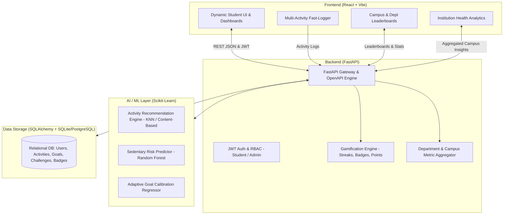

# FitConnect — System Architecture & Implementation Blueprint
**Smart India Hackathon 2026 Prototype**
*Theme: Student Innovation – Ideas that can boost fitness activities and assist in keeping fit*
*Core Philosophy: PROFILE → TRACK → CHALLENGE → REWARD*

---

## 1. High-Level Architecture Overview

FitConnect is designed as a modern, decoupled full-stack application with an asynchronous AI pipeline:



---

## 2. Directory & Scaffolding Structure

```
fit-connect/
├── ARCHITECTURE.md                  # System architecture & API blueprint (this file)
├── backend/                         # FastAPI backend
│   ├── app/
│   │   ├── __init__.py
│   │   ├── main.py                  # FastAPI application entrypoint & middleware
│   │   ├── core/
│   │   │   ├── config.py            # Environment configurations (JWT secrets, DB URLs)
│   │   │   ├── security.py          # Password hashing (bcrypt) & JWT token handling
│   │   │   └── database.py          # SQLAlchemy engine, session maker, base model
│   │   ├── models/                  # SQLAlchemy ORM database models
│   │   │   ├── user.py              # User & StudentProfile models
│   │   │   ├── activity.py          # ActivityLog model (walking, gym, sports, etc.)
│   │   │   ├── goal.py              # Personalized fitness goals
│   │   │   ├── challenge.py         # Campus/Department challenges & participants
│   │   │   └── gamification.py      # Points, Streaks, Badges, UserBadges
│   │   ├── schemas/                 # Pydantic validation schemas
│   │   │   ├── user.py
│   │   │   ├── activity.py
│   │   │   ├── goal.py
│   │   │   ├── challenge.py
│   │   │   ├── gamification.py
│   │   │   ├── ai.py
│   │   │   └── analytics.py
│   │   ├── api/                     # REST API route handlers
│   │   │   ├── deps.py              # Dependency injections (DB session, current user)
│   │   │   ├── v1/
│   │   │   │   ├── auth.py          # Student register, login, profile baseline
│   │   │   │   ├── activities.py    # Log, list, filter activities & calories
│   │   │   │   ├── goals.py         # Create, update, track personal targets
│   │   │   │   ├── challenges.py    # Campus challenges & team competitions
│   │   │   │   ├── leaderboards.py  # Individual & inter-department leaderboards
│   │   │   │   ├── ai.py            # AI recommendations & sedentary risk scoring
│   │   │   │   └── analytics.py     # Institutional campus wellness metrics
│   │   ├── services/                # Business logic engines
│   │   │   ├── calorie_service.py   # MET-based calorie calculations for activities
│   │   │   ├── streak_service.py    # Daily streak check & preservation logic
│   │   │   ├── badge_service.py     # Automated badge evaluation & unlocks
│   │   │   └── ranking_service.py   # Individual and department score calculations
│   │   └── ml/                      # Machine Learning models (Scikit-Learn)
│   │       ├── train.py             # Script to generate synthetic dataset & train models
│   │       ├── pipeline.py          # Inference helpers for fast prediction
│   │       └── artifacts/           # Serialized joblib/pickle model weights
│   ├── requirements.txt
│   └── seed_data.py                 # Mock campus data (CSE, ECE, Mech, Sports clubs)
│
├── frontend/                        # React.js SPA (Vite)
│   ├── public/                      # Static assets & icons
│   ├── src/
│   │   ├── assets/
│   │   ├── components/              # Modular UI components
│   │   │   ├── common/              # Navbar, Sidebar, Card, Badge, Modal, StatCard
│   │   │   ├── dashboard/           # ActivityRing, StreakCounter, QuickLogModal, TodayAIWidget
│   │   │   ├── activities/          # ActivityCard, ActivityFilters, CalorieCalculator
│   │   │   ├── challenges/          # ChallengeCard, ProgressBar, JoinChallengeModal
│   │   │   ├── leaderboard/         # PodiumView, DeptLeaderboardTable, StudentRankRow
│   │   │   ├── ai/                  # AIRecommendationCard, SedentaryWarningAlert
│   │   │   └── analytics/           # CampusDepartmentChart, WeeklyActivityHeatmap
│   │   ├── context/                 # AuthContext, ThemeContext, GamificationContext
│   │   ├── hooks/                   # useAuth, useActivities, useLeaderboard, useAI
│   │   ├── pages/                   # Application views
│   │   │   ├── LandingPage.jsx      # SIH showcase & feature highlight
│   │   │   ├── LoginPage.jsx        # Student & Admin authentication
│   │   │   ├── RegisterPage.jsx     # Campus registration & department assignment
│   │   │   ├── OnboardingPage.jsx   # Baseline fitness setup (sedentary hrs, preferred sports)
│   │   │   ├── DashboardPage.jsx    # Primary student hub (rings, stats, daily streaks)
│   │   │   ├── ActivitiesPage.jsx   # Log & review workouts (running, gym, yoga, sports)
│   │   │   ├── GoalsPage.jsx        # Personalized targets & completion progress
│   │   │   ├── ChallengesPage.jsx   # Inter-department clashes & campus fitness quests
│   │   │   ├── LeaderboardPage.jsx  # Student & department rankings + badges
│   │   │   ├── AICoachPage.jsx      # AI fitness suggestions & sedentary habit breaker
│   │   │   └── AdminAnalyticsPage.jsx # College administration health & wellness portal
│   │   ├── services/                # Axios / Fetch API client functions
│   │   │   ├── api.js               # Base HTTP client with JWT interceptor
│   │   │   ├── auth.js
│   │   │   ├── activities.js
│   │   │   ├── challenges.js
│   │   │   ├── gamification.js
│   │   │   ├── ai.js
│   │   │   └── analytics.js
│   │   ├── App.jsx                  # Route definitions (react-router-dom)
│   │   ├── main.jsx                 # React root mount
│   │   └── index.css                # Design system tokens, dark theme & glassmorphism
│   ├── package.json
│   └── vite.config.js
```

---

## 3. Database Entities & Relational Schema (ERD)

```mermaid
erDiagram
    USERS ||--|| STUDENT_PROFILES : has
    USERS ||--o{ ACTIVITY_LOGS : records
    USERS ||--o{ GOALS : sets
    USERS ||--o{ CHALLENGE_PARTICIPANTS : joins
    USERS ||--|| USER_STREAKS : tracks
    USERS ||--o{ USER_BADGES : earns
    USERS ||--|| USER_POINTS : accumulates
    CHALLENGES ||--o{ CHALLENGE_PARTICIPANTS : contains
    BADGES ||--o{ USER_BADGES : awarded_in

    USERS {
        uuid id PK
        string email
        string hashed_password
        string full_name
        string role "student | admin"
        string department "CSE | ECE | MECH | CIVIL | BIOTECH | MBA"
        string semester
        string hostel_or_commuter
        datetime created_at
    }

    STUDENT_PROFILES {
        uuid id PK
        uuid user_id FK
        float height_cm
        float weight_kg
        int age
        string gender
        float sedentary_hours_per_day "study + screen hours"
        string fitness_level "beginner | intermediate | advanced"
        json preferred_activities "['running', 'badminton', 'yoga']"
        float daily_calorie_target
        int daily_active_minutes_target
        datetime updated_at
    }

    ACTIVITY_LOGS {
        uuid id PK
        uuid user_id FK
        string activity_type "walking | running | cycling | gym | yoga | sports"
        string sub_activity "e.g., Football, Basketball, HIIT"
        float duration_minutes
        float distance_km
        float calories_burned
        string intensity "low | moderate | high"
        int heart_rate_avg
        string notes
        datetime logged_at
    }

    GOALS {
        uuid id PK
        uuid user_id FK
        string title
        string metric_type "calories | duration | sessions | distance"
        float target_value
        float current_value
        string period "daily | weekly"
        string status "active | completed | failed"
        date start_date
        date end_date
    }

    CHALLENGES {
        uuid id PK
        string title
        string description
        string challenge_type "individual | department | campus"
        string activity_type "all | running | cycling | yoga"
        string metric_type "duration_minutes | calories | activity_count"
        float target_goal
        int points_reward
        string badge_reward
        datetime start_date
        datetime end_date
        boolean is_active
    }

    CHALLENGE_PARTICIPANTS {
        uuid id PK
        uuid challenge_id FK
        uuid user_id FK
        string department
        float current_progress
        boolean is_completed
        datetime completed_at
    }

    USER_STREAKS {
        uuid id PK
        uuid user_id FK
        int current_streak
        int longest_streak
        date last_activity_date
    }

    USER_POINTS {
        uuid id PK
        uuid user_id FK
        int total_points
        string tier "Bronze | Silver | Gold | Diamond"
    }

    BADGES {
        string id PK
        string name
        string description
        string icon_name
        string category "streak | activity | challenge | milestone"
        int points_value
    }

    USER_BADGES {
        uuid id PK
        uuid user_id FK
        string badge_id FK
        datetime earned_at
    }
```



---

## 4. Scikit-Learn AI / Machine Learning Engine

To provide intelligent student guidance, the prototype incorporates three targeted ML models using Scikit-Learn:

### Model A: Adaptive Activity Recommender (K-Nearest Neighbors & Multi-Criteria Filtering)
- **Input Features**: Age, BMI, Sedentary Hours, Current Fitness Level, Past 7-Day logged sports, Time of Day / Exam Season Flag.
- **Output**: Ranked recommendation of 3 tailored activities (e.g., *"45-min sedentary detected: Recommended 15-min campus brisk walk or hostel dorm stretching"*).
- **Mechanism**: Feature vector matching with clustered student fitness personas to recommend non-monotonous activities that match preferences and fatigue levels.

### Model B: Student Sedentary Risk Classifier (Random Forest Classifier)
- **Input Features**: Average daily sedentary screen time, days since last workout, weekly active minutes deficit, semester period (mid-terms/finals).
- **Output**: Sedentary Risk Tier (`Low`, `Moderate`, `Severe Risk`) and personalized nudges to prevent academic-burnout-induced physical decline.

### Model C: Dynamic Goal Calibrator (Ridge / Linear Regression)
- **Input Features**: Prior 14-day completion rate, consistency score, missed sessions count.
- **Output**: Realistic adjusted target value (prevents students from setting unrealistic targets that cause early abandonment).

---

## 5. Frontend Pages & Component Hierarchy

1. **Onboarding & Baseline Setup (`/onboarding`)**:
   - Step 1: Physical Metrics (Height, Weight, Age).
   - Step 2: Lifestyle Audit (Screen/study hours, commute style).
   - Step 3: Sport & Workout Passions (Football, Gym, Yoga, Cycling, Cricket, Running).

2. **Student Dashboard (`/dashboard`)**:
   - `Header`: User greeting, active streak flame, total points badge, quick notification bell.
   - `ActivityRing`: Calorie and Active Minutes triple-ring visual.
   - `StreakCounterCard`: Consecutive days count + upcoming milestone badges.
   - `AIRecommendationBanner`: Real-time smart suggestion with "Quick Start" button.
   - `RecentActivitiesList`: Timeline of logged activities with calorie badges.

3. **Multi-Activity Logging (`/activities`)**:
   - Quick Log modal with instant MET-based calorie preview.
   - Activity categories: Walking, Running, Cycling, Strength / Gym, Yoga & Flexibility, Campus Sports.
   - Distance, duration, intensity toggles, and personal workout notes.

4. **Campus Challenges & Clash (`/challenges`)**:
   - Filter by: Campus-wide, Inter-Department, Solo Quest.
   - Interactive progress bar for joined challenges.
   - "Department Clash" widget displaying CSE vs ECE vs MECH collective fitness battle.

5. **Gamification & Leaderboard (`/leaderboard`)**:
   - Toggle: **Individual Hall of Fame** vs **Department Glory Board**.
   - Podium graphics for Top 3 student athletes.
   - Badges Grid: Locked vs Unlocked achievements (e.g., *"Campus Sprinter"*, *"Consistency Master"*, *"Dorm Stretcher"*).

6. **AI Fitness Coach (`/ai-coach`)**:
   - Sedentary Risk Gauge (Score 0-100%).
   - Daily personalized smart workout timetable.
   - Quick study-break desk stretch guides.

7. **Institutional Health Analytics (`/admin`)**:
   - Campus Physical Activity Index.
   - Department engagement comparison bar & radar charts.
   - Average sedentary hours across departments.
   - Anonymized aggregate health insights for college administrators.

---

## 6. Comprehensive REST API Plan (FastAPI)

| Endpoint | Method | Description | Auth Required |
|---|---|---|---|
| `/api/v1/auth/register` | `POST` | Register student with department & roll number | No |
| `/api/v1/auth/login` | `POST` | Authenticate & obtain JWT bearer token | No |
| `/api/v1/auth/me` | `GET` | Get current authenticated student / admin profile | Yes |
| `/api/v1/profile/baseline` | `POST` | Submit baseline fitness & sedentary parameters | Yes |
| `/api/v1/profile` | `GET/PUT` | Retrieve or update profile details | Yes |
| `/api/v1/activities/` | `POST` | Log new activity (calculates calories & points) | Yes |
| `/api/v1/activities/` | `GET` | Get user activity history (with date/type filters) | Yes |
| `/api/v1/activities/summary`| `GET` | Get daily & weekly total stats (rings data) | Yes |
| `/api/v1/goals/` | `GET/POST`| Fetch or create personal fitness goals | Yes |
| `/api/v1/goals/{id}` | `PUT` | Update goal progress or mark complete | Yes |
| `/api/v1/challenges/` | `GET` | List all available & active campus challenges | Yes |
| `/api/v1/challenges/{id}/join` | `POST` | Join a campus or department challenge | Yes |
| `/api/v1/challenges/my` | `GET` | List active challenges joined by current user | Yes |
| `/api/v1/gamification/streak`| `GET` | Get current user streak days & freeze status | Yes |
| `/api/v1/gamification/badges`| `GET` | List all badges & user unlock status | Yes |
| `/api/v1/gamification/leaderboard/individual` | `GET` | Individual student rankings (points/distance) | Yes |
| `/api/v1/gamification/leaderboard/department` | `GET` | Inter-department campus fitness standings | Yes |
| `/api/v1/ai/recommendations` | `GET` | ML-driven personalized activity suggestions | Yes |
| `/api/v1/ai/sedentary-analysis` | `GET` | Sedentary risk rating and study-break recommendations | Yes |
| `/api/v1/admin/analytics/overview` | `GET` | Campus-wide activity aggregate stats | Yes (Admin) |
| `/api/v1/admin/analytics/departments` | `GET` | Department-wise physical activity comparison | Yes (Admin) |

---

## 7. SIH Innovation Features Summary

1. **Overcoming Sedentary Study Habits**:
   Specifically targets college students who sit 8–12 hours coding, studying, or attending lectures with automatic sedentary risk alerts and micro-break recommendations.
2. **Multi-Activity, Beyond Just Steps**:
   Full support for gym sessions, yoga, cycling, running, and hostel sports (badminton, basketball, football, cricket) with MET-scientific calorie calculations.
3. **Department Clash & Healthy Campus Rivalry**:
   Turns fitness into a team sport where CSE, ECE, Mechanical, etc. compete for the campus fitness trophy, fostering widespread student participation.
4. **Institutional Health Index**:
   Provides university deans and physical education directors real-time, anonymized wellness data to inform campus sports events and facilities planning.
